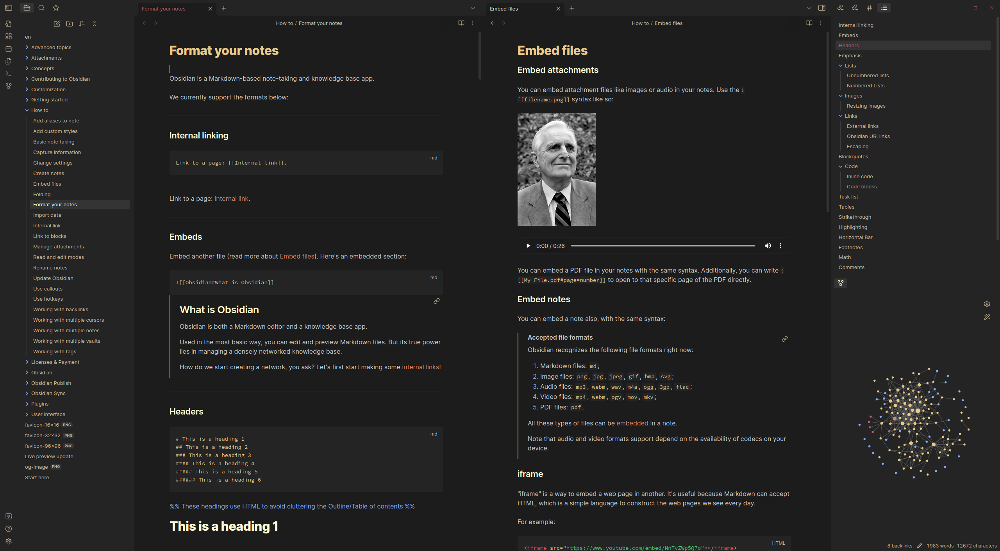
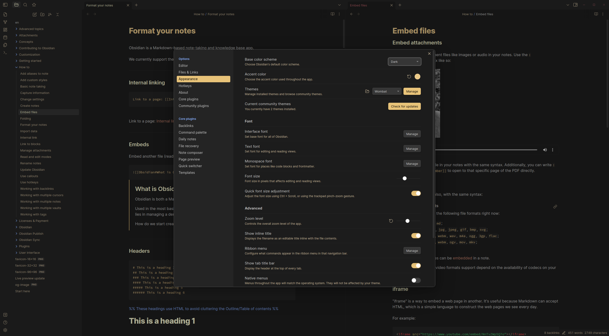

# Wombat for Obsidian.md

A minimalist theme for [Obsidian.md](https://obsidian.md), based on the [Wombat256](https://www.vim.org/scripts/script.php?script_id=2465) theme
for Vim.

Dark gray background with easy-on-the-eyes desert-like colors.

This is a dark theme only.

## Screenshot

## Inspired by

Some part of the CSS logic was inspired by the [Obsidian Nord](https://github.com/insanum/obsidian_nord) theme.
